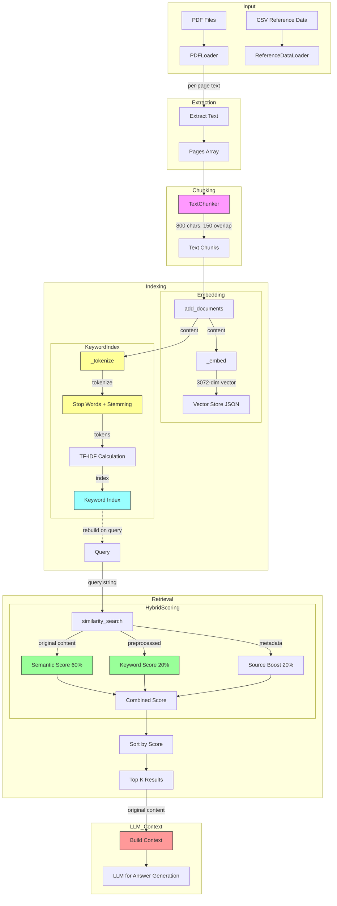
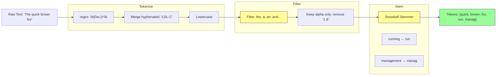

# RAG System Documentation

## Data Flow Overview

### Complete Pipeline (RAG + Keyword Search)



---

## Processing Stages Detail

### 1. PDF Extraction (`src/ingest/__init__.py`)

| Step | What Happens | Output |
|------|--------------|--------|
| PDF Loading | `pypdf.PdfReader` reads each PDF | `PdfReader` object |
| Page Extraction | `.extract_text()` per page | List of strings |
| Metadata | Page numbers attached | `{"page": 1, "content": "..."}` |

```python
# Output structure
{
    "id": "lipid_management",
    "source": "Lipid management.pdf",
    "pages": [
        {"page": 1, "content": "Hyperlipidaemia is characterized..."},
        {"page": 2, "content": "LDL cholesterol target..."}
    ]
}
```

---

### 2. Text Chunking (`src/processors/chunker.py`)

| Parameter | Value | Purpose |
|-----------|-------|---------|
| `chunk_size` | 800 chars | Maximum chunk length |
| `chunk_overlap` | 150 chars | Context preservation |
| Boundary detection | `\n\n` → `\n` → `. ` | Smart sentence breaks |

```python
# Output structure
{
    "id": "lipid_management_chunk_0",
    "source": "Lipid management.pdf",
    "page": 1,
    "content": "Hyperlipidaemia is characterized by elevated lipid..."
}
```

**Boundary Priority:**
1. Paragraph break (`\n\n`)
2. Line break (`\n`)
3. Sentence end (`. `)
4. Hard break at chunk_size

---

### 3. Keyword Index Processing (`src/vectorstore/store.py`)

#### Tokenization Flow



#### Stop Words (Filtered)

**English Stop Words:** (from NLTK)
```
a, an, the, and, or, but, is, are, was, were, be, been, being,
have, has, had, do, does, did, will, would, could, should,
may, might, must, shall, can, need, dare, ought, used,
i, me, my, myself, we, our, you, your, he, she, it, they...
```

**Medical-Specific Stop Words:** (added)
```
patient, patients, year, years, month, months, old, male,
female, gender, age, case, cases, study, group, result,
results, data, analysis, method, methods, background,
objective, conclusion
```

#### Stemming Examples

| Original | Stemmed | Note |
|----------|---------|------|
| running | run | Snowball stemmer |
| management | manag | Truncates -ement |
| diabetes | diabet | Truncates -es |
| prevention | prevent | Keeps full |
| LDL-C | ldl-c | **Preserved** (hyphen) |
| FH | fh | **Preserved** (all-caps) |

---

### 4. TF-IDF Scoring

#### Formula

```
TF-IDF = (1 + log(tf)) × IDF

IDF = log((N + 1) / (df + 1)) + 1  (smoothed)
```

| Variable | Meaning |
|----------|---------|
| `tf` | Term frequency in document |
| `df` | Document frequency (how many docs contain term) |
| `N` | Total number of documents |

#### Example

| Query | Doc A | Doc B |
|-------|-------|-------|
| "LDL" appears | 3 times | 1 time |
| TF-IDF Score | Higher | Lower |

---

### 5. Hybrid Search Weights

| Component | Weight | Description |
|-----------|--------|-------------|
| Semantic | 60% | Cosine similarity of embeddings |
| Keyword | 20% | TF-IDF match score |
| Source Boost | 20% | PDF=1.0, CSV=0.5 |

---

## FAQ: Retrieval Questions

### Q1: Is the original chunk content used for the LLM?

**Yes.** The original, unmodified chunk content is used when building the context for the LLM.

```python
# In retrieval, original content is returned:
results = vector_store.similarity_search(query, top_k=5)
# results[i]["content"] = ORIGINAL text (not stemmed, not preprocessed)
```

The stemming/TF-IDF only affects **ranking**, not the actual content delivered to the LLM.

---

### Q2: How does stemming affect which chunks are retrieved?

| Query | Document Contains | Matched? |
|-------|-------------------|----------|
| "running" | "running fast" | ✅ Yes (stemmed) |
| "run" | "running fast" | ✅ Yes (stemmed) |
| "management" | "managing diabetes" | ✅ Yes (stemmed) |
| "prevent" | "prevention" | ✅ Yes (stemmed) |

Stemming expands search coverage - variations of words map to the same root.

---

### Q3: How do stop words affect retrieval?

| Query | Stop Words Used? | Effect |
|-------|------------------|--------|
| "the diabetes" | No | Ignored, searches "diabetes" |
| "what is diabetes" | No | Searches "diabetes" |

Stop words are **filtered from both** query and documents, so they don't affect matching.

---

### Q4: What metadata is preserved in chunks?

| Metadata | Source | Example |
|----------|--------|---------|
| `id` | Generated | `"doc_chunk_0"` |
| `source` | PDF filename | `"Lipid management.pdf"` |
| `page` | PDF page number | `1` |

This metadata is returned with search results and used for source citation.

---

### Q5: Can I disable stemming or stop word filtering?

Currently no - they're hardcoded. Future enhancement could add flags:

```python
# Potential future API
vector_store = VectorStore(
    use_stemming=False,
    use_stop_words=False,
    use_tfidf=True
)
```

---

### Q6: Why are some acronyms like "LDL-C" preserved?

In `_should_stem()`:
```python
def _should_stem(word: str) -> bool:
    if "-" in word:
        return False  # Keep "LDL-C"
    if word.isupper() and len(word) > 1:
        return False  # Keep "FH", "BMI"
    return True
```

This preserves medical acronyms which are often meaningful as-is.

---

### Q7: What's the difference between semantic and keyword search?

| Aspect | Semantic (Embedding) | Keyword (TF-IDF) |
|--------|---------------------|------------------|
| Matching | Synonyms, similar meaning | Exact word match |
| Speed | Slower (API call) | Fast (local) |
| Acronyms | May miss | Exact match |
| Typos | Handles well | Fails completely |

Hybrid combines both for best results.

---

### Q8: How is the chunk overlap handled?

Overlap happens at the **text level**, not the indexing level:

```
Chunk 1: "The quick brown fox jumps over" (0-40)
Chunk 2: "over the lazy dog" (25-65)  ← 15 char overlap
```

- Both chunks are indexed separately
- Both can appear in results if relevant
- Overlap helps preserve context across boundaries

---

## File Structure

```
src/
├── ingest/
│   └── __init__.py          # PDFLoader - extract per page
├── processors/
│   └── chunker.py           # TextChunker - 800 char chunks
├── vectorstore/
│   └── store.py             # VectorStore - TF-IDF + embeddings
└── rag/
    └── retriever.py         # initialize_vector_store, retrieve_context

data/
├── raw/
│   ├── *.pdf               # Source PDFs
│   └── LabQAR/*.csv        # Reference data
└── vectors/
    └── medical_docs.json    # Indexed chunks + embeddings
```

---

## Testing Commands

```bash
# Run all tests
uv run pytest tests/ -v

# Run specific test file
uv run pytest tests/test_keyword_index.py -v

# Rebuild vector store
uv run python -c "from src.rag.retriever import initialize_vector_store; initialize_vector_store(rebuild=True)"

# Test retrieval
uv run python -c "
from src.rag.retriever import retrieve_context
result, sources = retrieve_context('LDL target')
print(sources)
"
```
