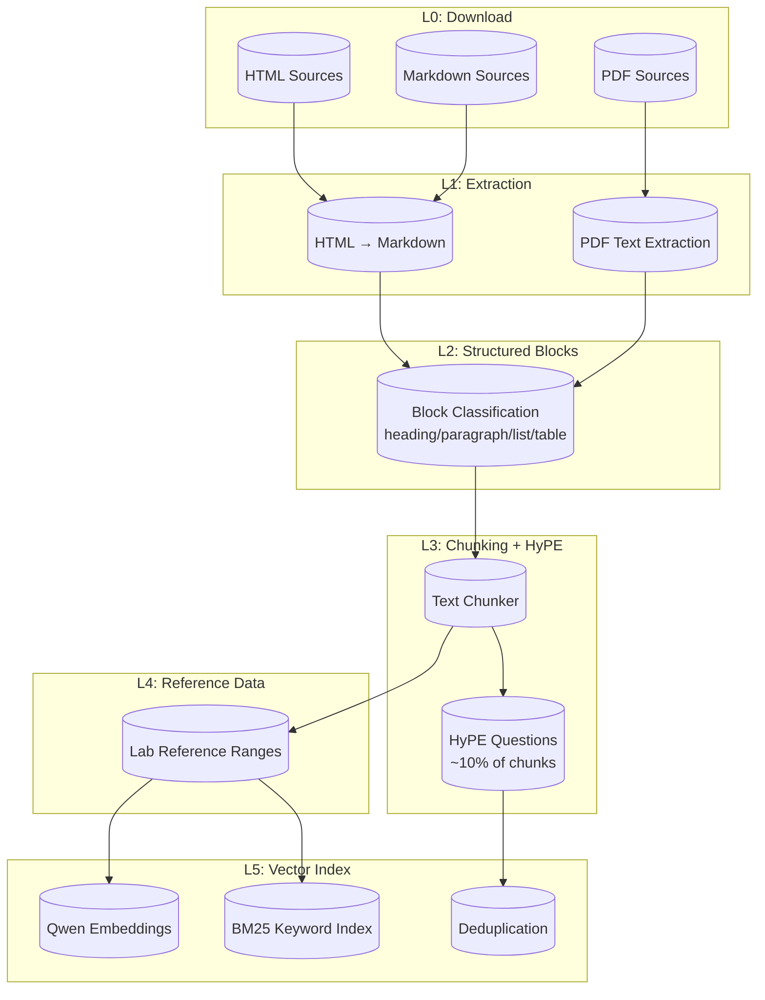
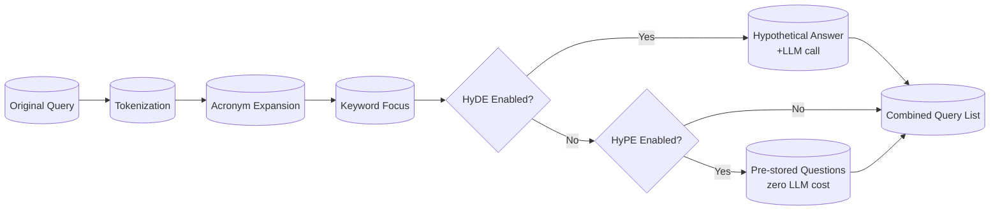

# Pipeline Strategies: Ingestion & Evaluation

Comprehensive documentation of the configurable strategies, data flow DAGs, and identified gaps in the RAG pipeline.

## Table of Contents

1. [Ingestion Pipeline DAG](#ingestion-pipeline-dag)
2. [Evaluation Pipeline DAG](#evaluation-pipeline-dag)
3. [Strategy Reference](#strategy-reference)
4. [Query Expansion Strategies](#query-expansion-strategies)
5. [Design Tradeoffs](#design-tradeoffs)
6. [Identified Gaps & Next Steps](#identified-gaps--next-steps)

---

## Ingestion Pipeline DAG



### Stage Details

| Stage | Module | Description |
|-------|--------|-------------|
| L0 | `src/ingestion/steps/download_web.py` | Downloads HTML sources |
| L1 | `src/ingestion/steps/convert_html.py` | HTML → Markdown conversion |
| L1 | `src/ingestion/steps/load_pdfs.py` | PDF text + table extraction |
| L2 | `src/ingestion/steps/load_pdfs.py` | Classifies blocks into types |
| L3 | `src/ingestion/steps/chunk_text.py` | Text chunking with quality scoring |
| L3 | `src/ingestion/steps/hype.py` | HyPE question generation |
| L4 | `src/ingestion/steps/load_reference_data.py` | Lab reference ranges |
| L5 | `src/ingestion/indexing/vector_store.py` | Hybrid vector + BM25 index |

---

## Evaluation Pipeline DAG

```mermaid
flowchart TB
    subgraph Config["Configuration"]
        EXP[("Experiment YAML<br/>or defaults")]
    end

    subgraph Setup["Runtime Setup"]
        RT_CONFIG[("configure_runtime")]
        RT_INIT[("initialize_runtime_index")]
    end

    subgraph StageChecks["Quality Checks (L0-L5)"]
        L0[("L0: Download Audit")]
        L1[("L1: HTML/MD Quality")]
        L2[("L2: PDF Extraction")]
        L3[("L3: Chunking Quality")]
        L4[("L4: Reference Quality")]
        L5[("L5: Index Quality")]
    end

    subgraph Dataset["Dataset Construction"]
        FIX[("Golden Fixtures")]
        SYN[("Synthetic Questions<br/>LLM-generated")]
        BOOT[("Bootstrap Labels")]
    end

    subgraph RetrievalEval["Retrieval Evaluation"]
        RET[("For each query:<br/>retrieve_context_with_trace")]
        METRICS[("hit_rate, MRR, nDCG,<br/>source_hit, evidence_hit")]
    end

    subgraph Optional["Optional Steps"]
        ABL[("Retrieval Ablations")]
        SWEEP[("Diversity Sweep<br/>mmr_lambda grid")]
        L6[("L6: Answer Quality<br/>DeepEval metrics")]
    end

    Config --> Setup
    Setup --> StageChecks
    StageChecks --> Dataset
    Dataset --> RetrievalEval
    RetrievalEval --> Optional
```



### Quality Check Stages

| Stage | Check | Key Metrics |
|-------|-------|-------------|
| L0 | Download audit | File count, size, manifest integrity |
| L1 | HTML/Markdown quality | Char count, link density, boilerplate ratio |
| L2 | PDF extraction | Replacement chars, line count, table detection |
| L3 | Chunking quality | Chunk size distribution, quality scores |
| L4 | Reference quality | Lab range completeness, currency |
| L5 | Index quality | Embedding dim, source distribution, index metadata |

---

## Strategy Reference

### PDF Extraction Strategies

| Strategy | Primary Extractor | Fallback | Table Extraction | Location |
|----------|------------------|----------|------------------|----------|
| `pypdf_pdfplumber` | pypdf | pdfplumber | heuristic or camelot | `src/ingestion/steps/load_pdfs.py` |
| `pymupdf_pdfplumber` | PyMuPDF | pdfplumber | heuristic or camelot | `src/ingestion/steps/load_pdfs.py` |

**Configuration:**
```python
set_pdf_extractor_strategy("pymupdf_pdfplumber")
set_pdf_table_extractor("camelot")  # or "heuristic"
```

### Table Extraction Strategies

| Strategy | Method | Use Case |
|----------|--------|----------|
| `heuristic` | Detects `\|` count or double-space patterns | Fast, rule-based |
| `camelot` | Camelot library with `lattice` flavor | Structured tables |

### Chunking Strategies

| Strategy | Type | Overlap | Embeddings | Location |
|----------|------|---------|------------|----------|
| `custom_recursive` | Recursive text splitting | Yes | None | `src/ingestion/chunking/` |
| `chonkie_recursive` | Chonkie's Pipeline | Yes (via refine_with) | None | `src/ingestion/chunking/` |
| `chonkie_semantic` | Chonkie's SemanticChunker | Manual (word-based) | Qwen (required) | `src/ingestion/chunking/` |
| `chonkie_late` | Chonkie's LateChunker | Manual (word-based) | Qwen (required) | `src/ingestion/chunking/` |

**Recursive Split Order:**
1. `\n\n` (paragraph break)
2. `\n` (line break)
3. Sentence boundary (`.!?`)
4. Word boundary (`;`, `,`, ` `)

**Default Configs:**
```python
pdf:       chunk_size=512, overlap=64, strategy="custom_recursive", min_chunk_size=100
markdown:  chunk_size=512, overlap=64, strategy="custom_recursive", min_chunk_size=80
```

### Search Modes

| Mode | Description | Use Case |
|------|-------------|----------|
| `rrf_hybrid` | Reciprocal Rank Fusion: semantic + BM25 | Balanced retrieval |
| `semantic_only` | Pure embedding similarity | When keywords irrelevant |
| `bm25_only` | Pure keyword search | Exact medical terminology |

### Retrieval Diversification

| Parameter | Default | Range | Description |
|-----------|---------|-------|-------------|
| `mmr_lambda` | 0.75 | 0.0-1.0 | Relevance vs diversity balance |
| `overfetch_multiplier` | 4 | 1+ | Fetch N×k candidates for reranking |
| `max_chunks_per_source_page` | 2 | 1+ | Cap chunks from same page |
| `max_chunks_per_source` | 3 | 1+ | Cap chunks from same source |

---

## Query Expansion Strategies



### HyDE vs HyPE

| Aspect | HyDE | HyPE |
|--------|------|------|
| **When** | Query time | Index time |
| **LLM Cost** | Every query | ~10% of chunks once |
| **Method** | "What answer would this query get?" | "What questions does this chunk answer?" |
| **Storage** | None | Questions in chunk metadata |
| **Latency** | +1 LLM call/query | Zero additional cost |

### Configuration

**HyDE (query-time):**
```python
# src/rag/runtime.py
RetrievalDiversityConfig(
    enable_hyde=True,
    hyde_max_length=200,  # words
)
```

**HyPE (index-time):**
```python
# src/config/settings.py
HYPE_ENABLED=True
HYPE_SAMPLE_RATE=0.1      # 10% of chunks
HYPE_MAX_CHUNKS=500
HYPE_QUESTIONS_PER_CHUNK=2
```

### Query Expansion Layers

1. **Original query** - User's exact input
2. **Tokenized** - `" ".join(tokenize_text(query))`
3. **Acronym expansion** - LDL → Low-Density Lipoprotein
4. **Keyword focus** - deduplicated, lowercase tokens
5. **HyDE hypothetical** - LLM-generated answer (when enabled)
6. **HyPE questions** - Pre-stored questions from index (when enabled)

---

## Design Tradeoffs

### PDF Extractor Choice

| Factor | pypdf_pdfplumber | pymupdf_pdfplumber |
|--------|------------------|-------------------|
| Speed | Faster | Slower |
| Text accuracy | Good | Better |
| Table handling | Good | Good |
| Memory | Lower | Higher |

**Recommendation:** Use `pymupdf_pdfplumber` for medical documents with complex layouts.

### Chunking Strategy

| Strategy | Pros | Cons |
|----------|------|------|
| `custom_recursive` | Fast, no API calls | May split semantic units |
| `chonkie_recursive` | Better overlap handling | Slightly slower |
| `chonkie_semantic` | Preserves semantic units | Requires embeddings at ingest |
| `chonkie_late` | Best semantic boundaries | Requires embeddings at ingest, slowest |

**Recommendation:** Use `custom_recursive` for speed; `chonkie_semantic` for quality.

### HyDE vs HyPE

| Scenario | Recommended |
|----------|-------------|
| Low query volume, high quality needed | HyDE |
| High query volume, cost-sensitive | HyPE |
| Stable corpus (rarely updated) | HyPE |
| Frequently changing corpus | HyDE |
| Medical domain (high precision needed) | Both |

---

## Identified Gaps & Next Steps

### High Priority

| Gap | Description | Impact |
|-----|-------------|--------|
| **HyPE Ablation Missing** | HyPE impact on retrieval not systematically evaluated | Can't quantify HyPE value |
| **Strategy Interaction Effects** | PDF extractor × chunking strategy combos unexplored | Suboptimal default config |
| **Late Chunker Not in Experiments** | `chonkie_late` defined but not in `chunking_strategies.yaml` | Missing evaluation coverage |

### Medium Priority

| Gap | Description | Impact |
|-----|-------------|--------|
| **Query Variation Benchmarks** | Which expansion layer matters most? | Unclear optimization target |
| **Acronym Expansion Scope** | Limited to predefined medical acronyms | May miss domain-specific terms |
| **Synthetic Question Quality** | Hard paraphrase / distractor generation not measured | Dataset bias unknown |

### Low Priority (Nice to Have)

| Gap | Description | Impact |
|-----|-------------|--------|
| **HyDE LLM Cost Tracking** | LLM calls for HyDE not in metrics | Can't track API costs |
| **Cold Start HyPE** | No incremental HyPE for new chunks | Recompute full index on small updates |
| **Cross-Encoder Reranking** | Not implemented | Could improve top-k precision |

---

### HyPE Ablation: Detailed Gap Analysis

#### Current State

HyPE (Hypothetical Prompt Embedding) is implemented but **not systematically evaluated**:

| Component | Status | Location |
|-----------|--------|----------|
| HyPE generation at index time | ✅ Implemented | `src/ingestion/steps/hype.py` |
| HyPE retrieval at query time | ✅ Implemented | `src/rag/runtime.py:658-664` |
| HyPE config in settings | ✅ Implemented | `src/config/settings.py:293-324` |
| HyPE in experiment YAMLs | ❌ **Missing** | Not in any `experiments/v1/*.yaml` |
| HyPE ablation variants | ❌ **Missing** | `retrieval_ablation_configs` doesn't test HyPE |
| HyPE metrics tracking | ⚠️ Partial | No dedicated HyPE-use metrics |

#### Root Cause

1. **Experiment config gap**: `RetrievalDiversityConfig` has `enable_hype` but `compute_assessment_config()` in `src/experiments/config.py:458-465` doesn't include it in `retrieval_options`:

```python
# Current retrieval_options excludes enable_hype:
"retrieval_options": {
    "search_mode": retrieval["search_mode"],
    "enable_diversification": retrieval["enable_diversification"],
    "mmr_lambda": retrieval["mmr_lambda"],
    "overfetch_multiplier": retrieval["overfetch_multiplier"],
    "max_chunks_per_source_page": retrieval["max_chunks_per_source_page"],
    "max_chunks_per_source": retrieval["max_chunks_per_source"],
    # ❌ enable_hype is missing!
}
```

2. **Ablation framework gap**: `retrieval_ablation_configs()` in `src/evals/assessment/retrieval_eval.py:354-369` only tests search modes, not HyPE.

#### Proposed HyPE Experiment Design

Create `experiments/v1/hype_strategies.yaml` with these variants:

```yaml
variants:
  # === HyPE On/Off Comparison ===
  - name: hype_disabled
    description: Baseline without HyPE (enable_hype=false)
    overrides:
      retrieval:
        enable_hype: false
        hype_sample_rate: 0.0  # Ingest without HyPE

  - name: hype_enabled_10pct
    description: HyPE with 10% chunk coverage (default)
    overrides:
      retrieval:
        enable_hype: true
        hype_sample_rate: 0.1

  - name: hype_enabled_50pct
    description: HyPE with 50% chunk coverage
    overrides:
      retrieval:
        enable_hype: true
        hype_sample_rate: 0.5

  - name: hype_enabled_100pct
    description: HyPE with 100% chunk coverage
    overrides:
      retrieval:
        enable_hype: true
        hype_sample_rate: 1.0

  # === HyPE + HyDE Combined ===
  - name: hype_hyde_combined
    description: Both HyPE (index-time) and HyDE (query-time) enabled
    overrides:
      retrieval:
        enable_hype: true
        enable_hyde: true
        hype_sample_rate: 0.1
        hyde_max_length: 200

  - name: hyde_only
    description: HyDE only, no HyPE
    overrides:
      retrieval:
        enable_hype: false
        enable_hyde: true
        hyde_max_length: 200

  # === HyPE Quality Thresholds ===
  - name: hype_high_quality_only
    description: HyPE only on high-quality chunks (quality_score > 0.8)
    overrides:
      retrieval:
        enable_hype: true
        hype_sample_rate: 0.05  # Tighter selection
        hype_min_quality_threshold: 0.8
```

#### Required Code Changes

1. **Add `enable_hype` to experiment config resolution** in `src/experiments/config.py`:

```python
"retrieval_options": {
    ...
    "enable_hype": retrieval.get("enable_hype", False),
    "enable_hyde": retrieval.get("enable_hyde", False),
    "hyde_max_length": retrieval.get("hyde_max_length", 200),
}
```

2. **Add HyPE ablation configs** to `src/evals/assessment/retrieval_eval.py`:

```python
def hype_ablation_configs(base_options: dict[str, Any] | None = None) -> list[tuple[str, dict[str, Any]]]:
    base = dict(base_options or {})
    return [
        ("hype_disabled", {**base, "enable_hype": False}),
        ("hype_10pct", {**base, "enable_hype": True}),
        ("hype_50pct", {**base, "enable_hype": True, "hype_sample_rate": 0.5}),
        ("hype_100pct", {**base, "enable_hype": True, "hype_sample_rate": 1.0}),
        ("hyde_only", {**base, "enable_hype": False, "enable_hyde": True}),
        ("hype_plus_hyde", {**base, "enable_hype": True, "enable_hyde": True}),
    ]
```

3. **Track HyPE contribution in metrics**:

```python
# In evaluate_retrieval, add:
"hype_questions_used": sum(1 for q in expanded_queries if q in all_hype_questions.values()),
"hype_coverage_pct": len(all_hype_questions) / total_chunks * 100,
```

#### Key Metrics to Compare

| Metric | hype_disabled | hype_10pct | hype_50pct | hype_100pct |
|--------|---------------|------------|------------|-------------|
| hit_rate@k | baseline | Δ | Δ | Δ |
| mrr | baseline | Δ | Δ | Δ |
| ndcg@k | baseline | Δ | Δ | Δ |
| evidence_hit_rate | baseline | Δ | Δ | Δ |
| latency_ms | baseline | ≈ | ≈ | ≈ |
| LLM cost/query | $0 | $0 | $0 | $0 |

#### Expected Outcomes

1. **HyPE should improve recall** for queries where the question phrasing differs from document language
2. **Higher sample rate → diminishing returns** after some threshold
3. **HyDE + HyPE combined** may overlap - need to verify complementary value
4. **Zero latency cost** should make HyPE attractive vs HyDE

---

## File Locations

| Component | File |
|----------|------|
| HyDE (query-time) | `src/rag/hyde.py` |
| HyPE (index-time) | `src/ingestion/steps/hype.py` |
| PDF Extraction | `src/ingestion/steps/load_pdfs.py` |
| Chunking | `src/ingestion/steps/chunk_text.py` → `src/ingestion/chunking/` |
| Runtime Retrieval | `src/rag/runtime.py` |
| Evaluation Orchestrator | `src/evals/assessment/orchestrator.py` |
| Retrieval Metrics | `src/evals/assessment/retrieval_eval.py` |
| Experiment Configs | `experiments/v1/*.yaml` |
